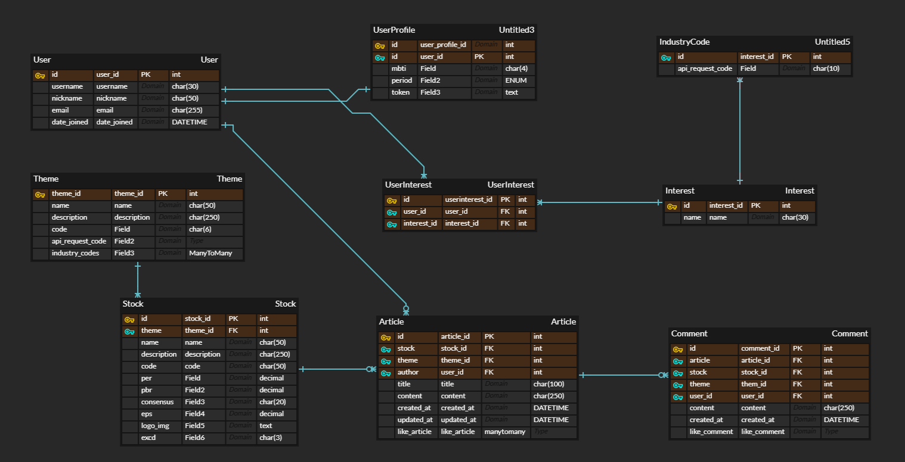
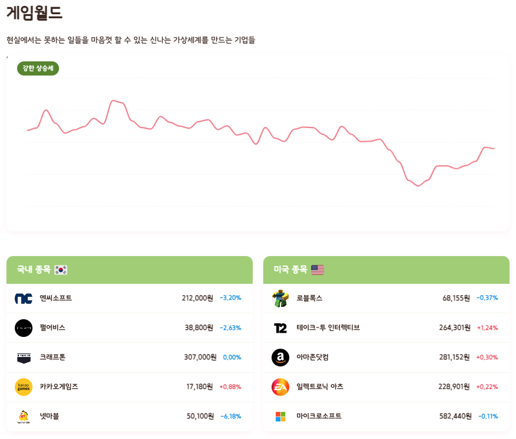
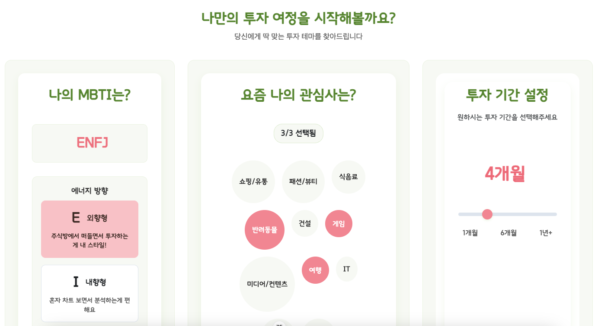
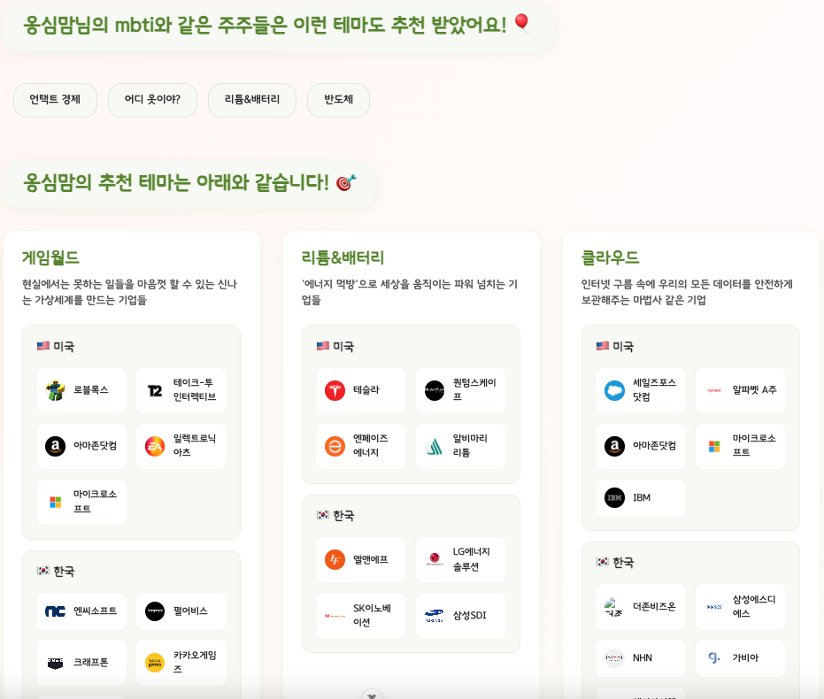

# 최종 관통 프로젝트 

## 주린이의, 주린이에 의한, 주린이를 위한 ZoozooLand

- 팀장: 최진문, 팀원: 이혜령  

### 1. 팀원 정보 및 업무 분담 내역
- 최진문(팀장) :star:
    - Backend(Django)
  	- `Auth` 구성 및 Authentication 구조 설계
  	- 외부(한국투자증권) `API 통신` 및 front 전달. 필요한 경우 DB 저장
    - front 요청에 적절한 데이터로 응답하기 위해 외부 API의 다양한 요청 Path 정리
- 이혜령(팀원) :woman:
  	- Frontend(Vue.js)
  	- View 및 컴포넌트 구조 설계
  	- ApexChart 라이브러리 활용 정적 데이터 `Chart 시각화`
  	- Websocket 활용 외부 `API 직접 통신` -> 동적 데이터 Chart 시각화
  	- CSS 구조 설계 및 레이아웃 구성  

### 2. 설계 내용(아키텍쳐 등) 및 실제 구현 정도

- 주식:dollar: 이라는 금융 상품이 마냥 어렵게만 느껴지는 주린이:baby: 를 위해 `간편`하면서도 투자에 `핵심`적인 정보는 제공하는 웹 어플리케이션

- 필수 기능
  	- 정적 차트와 실시간 `차트 정보` 제공(필요한 경우 동시에 제공 가능하도록)

  	- 주요 재무지표와 증권사 컨센서스 정보 제공
  	- 간편하게 입력받은 3가지 정보(mbti / 관심사 / 투자기간)를 기반으로 6가지의 테마(주식 바구니)를 추천
  	- 내가 추천받은 주식에 대해 다른 사람들은 어떻게 생각할까? -> 해당 주식을 위한 커뮤니티를 구성, 닉네임과 함께 해당 글쓴이의 MBTI 정보 제공.
  	- 트렌드를 반영, `미국주식`에 대한 대부분의 서비스 제공(실시간 price 정보 미제공)
  	 
- 최초 아이디어 회의 시 주린이 캐릭터를 만들고 리워드 시스템을 구성해 주식 교육을 진행, 주린이를 성장시킬 수 있도록 구성하고자 하였음.

- 하지만 필수기능들(현재 구현된 기능)의 우선순위에 밀려 구현되지 못함 :cry:  
 

### 3. 데이터베이스 모델링(ERD)
  

### 4. 금융 상품 추천 알고리즘에 대한 기술적 설명  

- 추천 페이지에서 유저에게서 입력받은 관심사를 기반으로 관련 테마를 추천. 
  - 예를들어 `금융`과 `IT`에 관심이 있는 유저에게는 `핀테크` 테마를 추천. `핀테크` 테마는 한국의 경우 업종코드 `00020(통신업) + 00021(금융업) + 00024(증권) + 00025(보험) + 00026(서비스업)`의 조합으로 매핑됨.  

### 5. 서비스 대표 기능들에 대한 설명  

- 선정한 금융상품(주식)의 특성상 최신 데이터를 `업데이트 하는 로직`이 중요. 
  	- 원활한 통신을 위해 비교적 정적인 데이터는 Django와 외부 API 간 통신 이후 vue로 응답. 
  	- 국내주식 중 Day Chart data의 경우 실시간 데이터 매핑이 필요, 외부 API와 vue 간 직접 통신으로 해결.
  	 
- 한국과 미국 실제 개별종목의 실시간(동적) 차트와 과거(정적) 차트를 `시각화` 하기 위해 vue.js의 `ApexChart 라이브러리` 활용.
  	- 한국주식의 경우 Websocket을 통해 외부 API와 실시간 통신을 통해 받아오는 데이터와 접속시간부터 장 시작시간까지의 과거 데이터를 `결합`하여 하나의 차트에 그리는 과정이 매우 힘든 과정이었음.
  	- Day Chart를 비롯해 다양한 `Period`(week / 1 month/ 6 month / year) Chart 정보를 제공.
		
  	
		- 테마 자체에 대한 평균치 시각화 차트를 제공함으로써 업종의 `전반적인 시황 파악`이 용이한 정보 제공
  	  

- `접근성`이 좋은 입력값(mbti 등)을 활용, 커뮤니티 환경과 동일 MBTI user의 추천 테마를 보여줌으로써 선정한 금융상품(주식)에 대한 접근도 간편하다는 인식 고취.
	
	
- 최종적으로 개별 종목에 대한 정보와 개별 종목 자체 커뮤니티 서비스를 제공. `공통` 관심사면서 `공통`으로 관심있는 주식에 대해 `소통`할 수 있는 환경 조성. 추가적으로 작성자의 MBTI 정보를 제공해 접근성 고취.
    

### 6. 생성형 AI를 활용한 부분  

  - 프로젝트 의도 및 설계를 기반으로 필요한 `Models 설계` 시 활용
  - 외부 API 요청 시 필요한 파라미터 및 로직에 대한 조언 / 성능 향상을 위한 `리팩터링` 시 활용
  - apexChart 라이브러리 활용 시 DOCS 기반 활용법에 대한 조언 / 성능 향상을 위한 `리팩터링` 시 활용
  - CSS 및 HTML `레이아웃 구성` 시 큰 틀에 대한 아이디어 제시 및 구현을 위한 조언이 필요한 경우 활용
  - DRM을 활용해 SQlite DB에 접근해 `복잡한 JOIN`을 수행해야하는 경우 아이디어 제시 및 코드 리팩터링 시 활용
  - 로직 정리 중 `복잡한 분기처리`의 경우(ex, 국내주식과 해외주식의 chart, main_info, consensus 분기처리, Day Chart 실시간 여부와 주말 여부에 대한 분기처리 등)
  - 유저의 `dummy profile image`를 생성형 ai를 활용해 생성.  
    
### 7. 느낀점

- 진문: 세상에 그냥 만들어진 `버튼`은 없다.. 아무 생각 없이 이용했던 웹 사이트 서비스들이 알고보니 굉장히 많은 땀과 고민으로 만들어졌다는 것을 알게되는 계기가 되었다. 해커톤 방식으로 진행되는 프로젝트다 보니 어쩔 수 없이 구현 위주로 프로젝트를 진행할 수 밖에 없어서 아쉬웠음! 추후 back 로직과 front의 로직을 찬찬히 뜯어보면서 리팩터링을 진행할 때 진정으로 공부가 되지 않을까 싶다. `목표!` 코드 리팩터링의 과정을 블로그에 연재할 것!

- 혜령: 9일이라는 시간 동안 하나의 웹서비스가 진짜 만들어질까? 라고 생각했는데,, 진짜 만들어졌다..! 9일 이라는 시간이 어떻게 지나가는지 모를 정도로 프로젝트에 집중했던 것 같다. 시간이 제한되어 구현하고자 하는 기능(주린이 키우기, 교육 컨텐츠)을 다 넣지 못한 것이 너무너무 아쉽지만, 그래도 하루하루 지날 수록 눈에 다르게 페이지가 채워지고, 완성도 있는 결과물이 나온 것에 대해 너무 뿌듯하다. 한 학기 동안 배운 것들을 총 정리하고 실제 쓰임을 정확하게 몸으로 느껴볼 수 있었던 시간이었던 것 같다.
이 프로젝트를 진행하면서 어려웠던 점은 주식 페이지 특성상 정보가 실시간으로 바로바로 업데이트 되어 보여져야 한다는 특수성 때문에 백에서도 계속 API 요청을 하고, 프론트에서도 웹소켓 통신, axios 통신 하다보니, 한 페이지에 많은 호출이 존재했다. 
그 함수들을 호출하는 타이밍과 응답/요청된 데이터들을 잘 관리하는 일이 가장 힘들고 어려웠다. 또한 ERD, Model, URL, 응답/요청 변수명의 사전 설계가 매우 중요하다는 것을 느꼈다...! 다음 프로젝트를 진행할 땐 조금 더 꼼꼼하게 구성을 짜야겠다는 생각이 들었다ㅎㅎ!
		